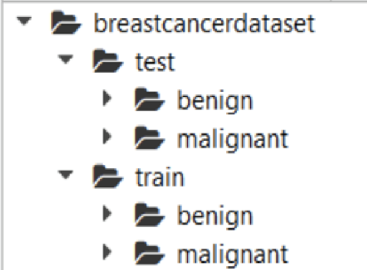

# Breast Cancer Risk Prediction

A deep learning project that classifies breast cancer histopathology images as benign or malignant using a convolutional neural network (CNN). The model is deployed as a web application using Flask.

## Project Overview
This project builds a CNN model to automatically classify breast histopathology images into benign or malignant categories. The trained model is integrated into a Flask web application, allowing users to upload and analyze histopathology images.
### Features
1. Deep learning model for binary classification of breast cancer histopathology images
2. Web application interface for real-time predictions
3. Detailed visualizations of model performance
4. Preprocessing pipeline for image data

## Dataset
The project uses a breast cancer histopathology image dataset with the following structure:

**Note:** The dataset is not included in this repository due to size constraints. Please visit the given link to download the dataset - https://www.kaggle.com/datasets/paultimothymooney/breast-histopathology-images

Extract it to the `breastcancerdataset/` folder in the project root

## Project Workflow
1. **Download the dataset** - Instructions for obtaining the histopathology image dataset
2. **Classify the dataset** - Split into train and test sets
3. **Add neural network layers** - Create CNN architecture
4. **Train the model** - Load training images and fit the model
5. **Test the model** - Evaluate model performance
6. **Save the model** - Store model and dependencies
7. **Deploy the application** - Build a Flask web application

## Model Architecture
The model consists of:  
• 3 convolutional layers with ReLU activation  
• Max pooling after each convolutional layer  
• Dropout layer to prevent overfitting  
• Dense layer with sigmoid activation for binary classification
